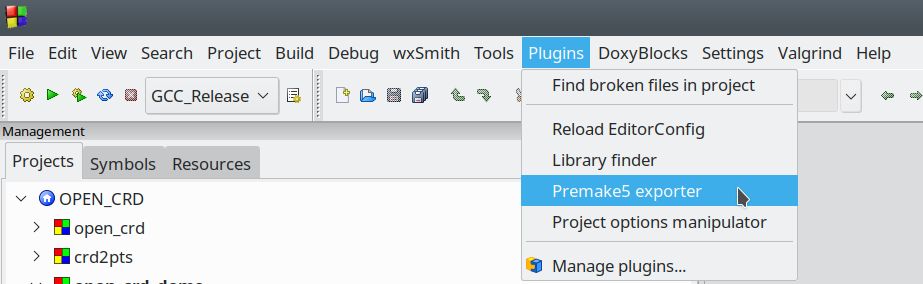
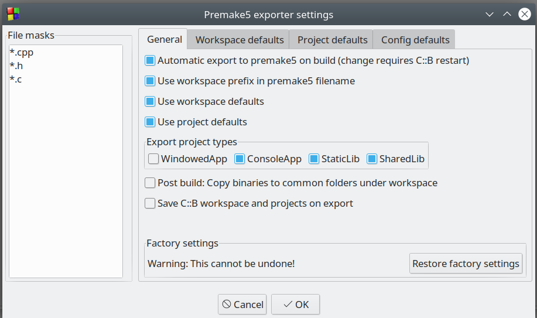
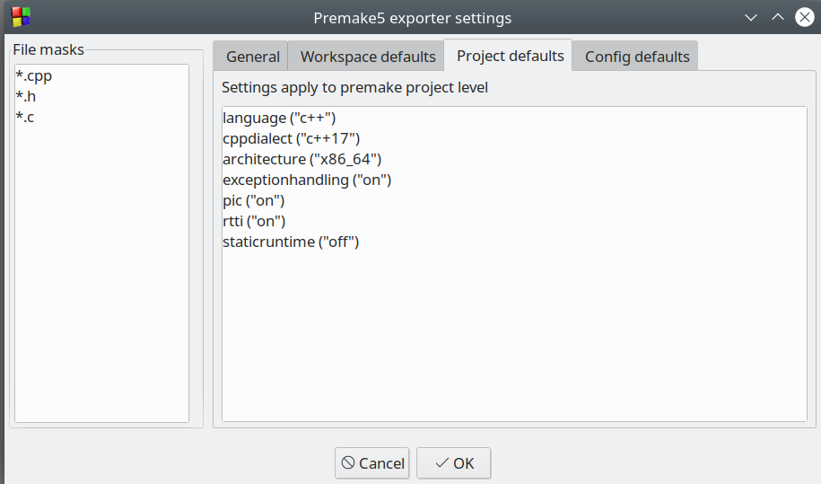
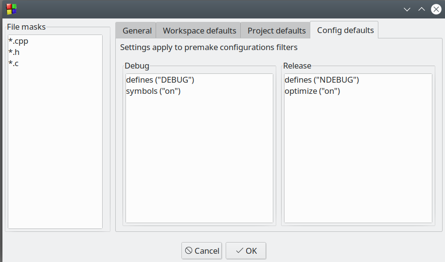

# premake5cb (a.k.a. Premake5 exporter)

About Premake: 

premake5cb is Code::Blocks plugin to generate [Premake5](https://premake.github.io/docs/) scripts for Code::Blocks workspaces. This makes it possible to generate make files, Visual Studio solutions etc. from a C::B workspace.

Plugin settings are available from the Code::Blocks plugin menu, select *Premake5 exporter*.




You may define file name masks for files to be included and several flags to control the way the plugin works. If the option *Automatic export on build* is enabled, the premake5 script will be regenerated every time you compile in Code::Blocks. Alternatively, you can export the premake5 script manually using File -> Export -> Premake5 export ...



There are  tabs for defining premake5 code snippets for workspace, project and configuration filters. These settings are applied before the Code::Blocks projects are examined, so they are to be considered defaults values.



The Config defaults contain filters for Debug and Release




## Briefly, how to use Premake5 exporter

Let's say you have a Code::Blocks workspace *OPEN_CRD.workspace* with some projects and have generated *OPEN_CRD_premake5.lua* from it. You can then run premake from the terminal and generate e.g. make files
    
```
$ premake5 --file=OPEN_CRD_premake5.lua gmake2

Building configurations...
Running action 'gmake2'...
Generated buildpm5/Makefile...
Generated buildpm5/open_crd/Makefile...
Generated buildpm5/crd2pts/Makefile...
Done (50ms).
```
Now you can buld the code

```
$ cd buildpm5
make
```


## Requirements

While efforts have been made to make this fairly general, not everything will work out of the box, but many projects will. Here are some key points

* A Code::Blocks workspace file must exist, and the projects in the workspace must be stored under the folder where the workspace file is located.

* C/C++ code is assumed, but this can be adjusted with file name filters

* Project dependencies within the workspace is maintained on premake export

* Two build configurations are supported, Debug and Release. These correspond roughly to build targets in Code::Blocks.

* External dependencies can be handled using premake5 commands [includedirs](https://premake.github.io/docs/includedirs/) and [libdirs](https://premake.github.io/docs/libdirs/) in either workspace defaults, project defaults or in configs. See also Premake documentation for other possibilites.

* Projects such as static libraries, shared libraries and console applications are supported.
* 
* Projects using wxWidgets are initially not supported, but this should change soon.

* Initially, the plugin runs only under Linux, but the generated Premake5 script can be used on Windows.
