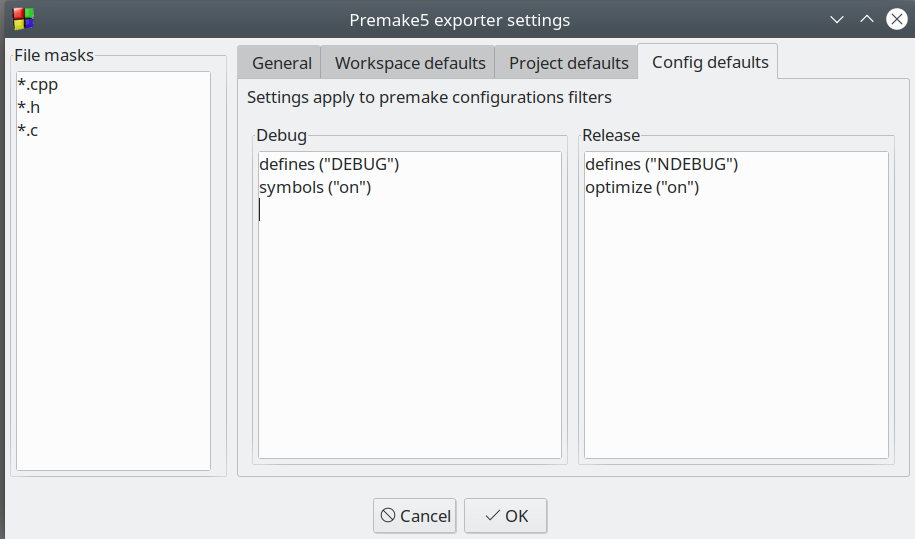

# premake5cb (a.k.a. Premake5 exporter)

*Premake5 exporter* is a [Code::Blocks](https://www.codeblocks.org/) plugin to generate [Premake5](https://premake.github.io/docs/) scripts for Code::Blocks workspaces. This makes it possible to generate GNU Makefiles, MS Visual Studio solutions etc. from a C::B workspace.

## Overview

Assume a Code::Blocks workspace *OPEN_CRD.workspace* exists with some projects. With the* Premake5 exporter* plugin activated the file *OPEN_CRD_premake5.lua* is created in the same folder (see Figure 1 ). One can then run premake from a terminal and generate e.g. make files:
    
```
$ premake5 --file=OPEN_CRD_premake5.lua gmake2

Building configurations...
Running action 'gmake2'...
Generated buildpm5/Makefile...
Generated buildpm5/open_crd/Makefile...
Generated buildpm5/crd2pts/Makefile...
Done (50ms).
```

With GNU Makefiles one can then build the code for all the projects in the workspace:

```
$ cd buildpm5
make
```

**Figure 1 - Manual export to Premake5**


```

```
## Settings

The plugin has several user adjustable options. The idea with the settings is to provide defaults for values that may not be directly available in the original Code::Blocks workspace or project files.

* First, defaults are applied from the GUI settings, i.e. on workspace, project and config levels.

* Second, values from Code::Blocks workspace, project and build targets may override or add new values.


The settings dialog is accessed via the Code::Blocks Plugins menu:

**Figure 2 - Acessing the Premake5 exporter settings**


```

```
### General
Under *General*, settings include file name masks for files to be included and options to control the way the plugin works. 

* Enabling *Automatic export on build*  causes the premake5 script to be regenerated every time you compile in Code::Blocks, eliminating the need for manual export (ref. Figure 1). 

* Disabling *Use workspace prefix in premake5 filename* results in simplified filename *premake5.lua*, eliminating the need for using --file=filename option in the premake5 command. 

* Disabling *Use workspace/projects defaults* causes their contents to be ignored on export. 

* Pressing the *Restore factory settings* does the obvious thing it resets all options back to their plugin install state.

**Figure 3 - General**


```

```
### Project defaults
There are  tabs for defining premake5 code snippets for workspace, project and configuration filters. These settings are applied before the Code::Blocks projects are examined, so they are to be considered defaults values.

**Figure 4 - Project defaults**


```

```
### Config defaults

The Config defaults contain filters for Debug and Release, and are roughly equivalent to Code::Blocks build targets. The plugin supports 2 predefined configuration filters: *debug* and *release*

**Figure 4 - Config defaults**



```

```


## Features

In order to make things work, some assumptions have been made. This may imply that not all Code::Blokcs workspaces will export and build without manual adjustment, but some will. Some may require just a bit of manual adjustments and serve as a useful starting point anyway.

* Initially, the plugin builds under Linux only. Constructive assistance to enable Windows build is welcome, consider creating a pull request. The generated Premake5 script can be used for generating [Windows builds](https://premake.github.io/docs/Using-Premake) as well as GNU Makefiles.

* A Code::Blocks workspace file must exist, the workspace projects must be stored under the workspace folder (long paths are ok).

* Projects such as static libraries, shared libraries and console applications are supported.

* C/C++ projects are assumed, but this can be adjusted with file name filters. C++ language dialect settings such as -std=c++17 are in Code::Blocks are transferred, as well as possible preprocessor #defines.

* Code::Blocks project dependencies within a workspace are handled on premake export. Include and link paths are automatically managed. It is important to note that when a project links to another project in the same Premake5 workspace, the reference is by project name, not library name. The plugin handles this automatically.

* External dependencies can be managed manually using premake5 commands [includedirs](https://premake.github.io/docs/includedirs/) and [libdirs](https://premake.github.io/docs/libdirs/) in either workspace defaults, project defaults or in configs. See also [Premake documentation](https://premake.github.io/docs/) for other possibilites. It is possible to use environment variables in such commands, but be aware that if you want to enter something like ${ENVIRONMENT_VARIABLE} in the settings dialog, it must be written as $[ENVIRONMENT_VARIABLE] for the time being.

* Projects using wxWidgets are initially not automatically supported, but the ambition is to improve this.


```

```
